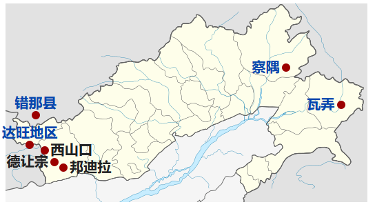

#### 中印自卫反击战的基本情况
1. 作战时间
   1. 开始时间 结束时间
2. 参战情况
   1. 投入兵力
   2. 投入装备
   3. 伤亡损失

------
#### 历史背景
- 边境争端
  - 阿克赛钦
  - 藏南
  - 解放军进驻西藏
  - 国际局势--古巴导弹危机

#### 战争起因
- 1953年印军跨越麦克马洪线
- 1958年印军与中国边防军队发生冲突，一名印军被击毙，中方控制了原为印军的阵地。9.8日周恩来对行动进行解释，声明行动的目的是为了防止残余的西藏叛乱分子出入边境
  >《新中国外交风云（第一辑）》，外交部外交史编辑室（1990年），页71。转引自《中共处理边界争议的战略选择(1949-2009)-守势现实主义的验证》，何函洁（2013年），页154
- 1961印军越过实际控制线建立43个据点
- 1962年印军建立一百多个据点，东段越过麦克马洪线，进入西藏山南的扯东地区，哨所互相穿插
- 1962年9月22日《人民日报》发表了《是可忍，孰不可忍》社论警告尼赫鲁政府立即从边境撤军，否则中方将使用武力。

------
#### 兵力部署
- 中方
  - 新疆军区
  - 西藏军区
- 印方
  - 陆军第四师

------
#### 战争简要经过
- 第一阶段
  - 克节朗之战
  - 10月24日中国政府发表声明，提出通知冲突、重开谈判、和平解决边界问题三项建议，提议双方从战前边境线后撤20公里，印度表示无法接受，并大力增援士兵
  - 11月3日，美国的紧急军事援助抵达印度
  - 中国军队在10月20日后开凿了一条从错那到达旺前线的战备公路

- 第二阶段
  - 瓦弄之战
  - 西山口邦迪拉战斗

- 汇总及后续
  - 中国边防部队共歼灭印军两个旅和三个旅的大部，击毙第62旅旅长豪尔·辛格准将，毙、伤、俘达尔维旅长以下官兵8700余人。印度朝野提议要求美国介入。 
  - 11月19日尼赫鲁向肯尼迪求援，肯尼迪下令美国航空母舰编队紧急驶往孟加拉湾
  - 11月21日，中国边防军发表停火声明，并在22日起单方面停火，在一个月后全线后撤至中印双方实际控制线北20公里外，与印军脱离接触，另外还单方面将缴获的武器军车等军用物资交还印方。

- 停战原因分析
  - 美苏冷战大背景
    - 印度收到美英苏不同程度的支持，防止其他国家接入战争
  - 后勤能力不足
  - 三年自然灾害，大跃进，无法维持长期战争
  - 告知世界中国没有侵略他国的意图
  - 阿克赛钦地区是有效阻断苏印交流的通道
    - 中苏交恶在中印战争之前却已经是不争的事实了，当时，西藏平叛不久，管理和统治尚未完全稳定，如果不能够在新疆与西.藏西南部之间建立起战略通道，中国的整个西南部地区都将危矣。控制克什米尔区域的阿克赛钦地区，有效阻断了苏印之间的联接，贯通了新藏战略通道，达到了最佳战略目的。
  - 中印在第一阶段中方有过政治承诺，信守诺言能够积累国际政治信用，获得国际政治信誉，为今后谈判解决边界问题大侠政治基础
  - 中国表现了能够控制边境地区的军事能力，即使不在进攻也能保持威慑，同时绝对的实力差距也让印度明白了拳头大才能说话的道理，从而不敢轻举妄动。达到目的之后不需要再多花费人力物力在进攻上了。

--------
#### 世界各方态度

###### 支持中国
- 1962年11月22日，越南民主共和国发表声明支持中国
- 11月23日，朝鲜政府发表声明
- 巴基斯坦在被印度拒绝共同防御中国之后1962年与中国开战边境谈判，并进展迅速，于当年12月达成协议

###### 支持印度
- 苏联
  - 表面支持中国，实际卖武器拉拢印度

###### 虽然老蒋坚持领土完整，但貌似台湾只是叫嚣着反攻大陆，没有成为另一个导火索罢了

#### 一些重要资料
- 亨德森·布鲁克斯报告